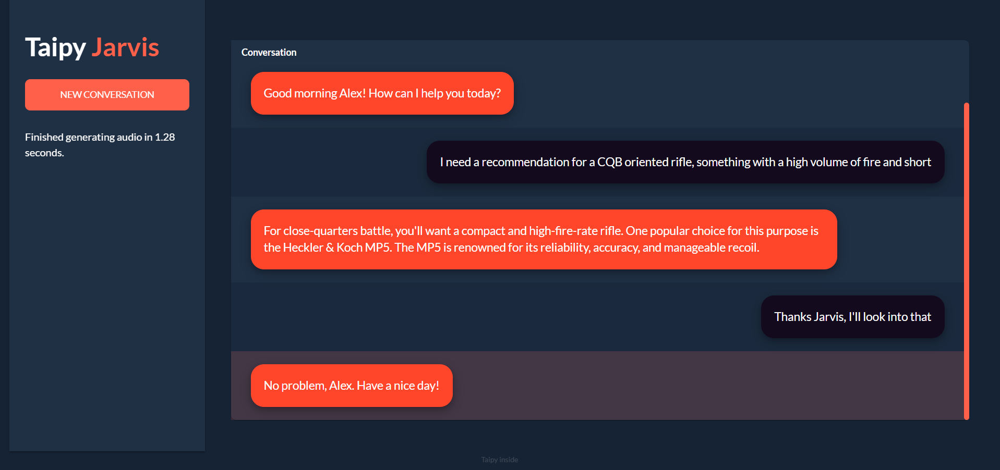
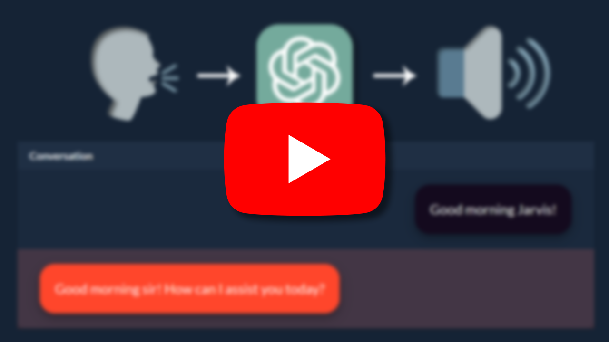
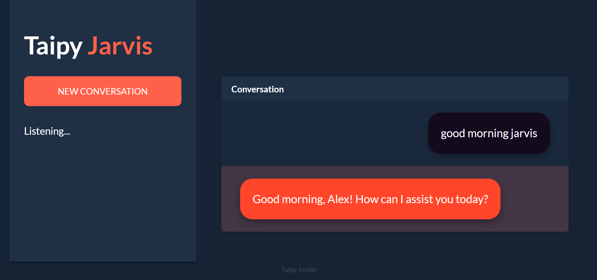

# JARVIS

<p align="center">
  
</p>

Your own voice personal assistant: Voice to Text to LLM to Speech, displayed in a web interface.

## How it works

1. :microphone: The user speaks into the microphone
2. :keyboard: Voice is converted to text using <a href="https://deepgram.com/" target="_blank">Deepgram</a>
3. :robot: Text is sent to <a href="https://openai.com/" target="_blank">OpenAI</a>'s GPT-3 API to generate a response
4. :loudspeaker: Response is converted to speech using <a href="https://elevenlabs.io/" target="_blank">ElevenLabs</a>
5. :loud_sound: Speech is played using <a href="https://www.pygame.org/wiki/GettingStarted" target="_blank">Pygame</a>
6. :computer: Conversation is displayed in a webpage using <a href="https://github.com/Avaiga/taipy" target="_blank">Taipy</a>

## Video Demo

<p align="center">
  <a href="https://youtu.be/aIg4-eL9ATc" target="_blank">
    
  </a>
</p>

## Requirements

**Python 3.8 - 3.11**

Make sure you have the following API keys:
- <a href="https://developers.deepgram.com/docs/authenticating" target="_blank">Deepgram</a>
- <a href="https://platform.openai.com/account/api-keys" target="_blank">OpenAI</a>
- <a href="https://elevenlabs.io/docs/api-reference/text-to-speech" target="_blank">Elevenlabs</a>

## How to install

1. Clone the repository

```bash
git clone https://github.com/AlexandreSajus/JARVIS.git
```

2. Install the requirements

```bash
pip install -r requirements.txt
```

3. Create a `.env` file in the root directory and add the following variables:

```bash
DEEPGRAM_API_KEY=XXX...XXX
OPENAI_API_KEY=sk-XXX...XXX
ELEVENLABS_API_KEY=XXX...XXX
```

## How to use

1. Run `display.py` to start the web interface

```bash
python display.py
```

2. In another terminal, run `jarvis.py` to start the voice assistant

```bash
python main.py
```

- Once ready, both the web interface and the terminal will show `Listening...`
- You can now speak into the microphone
- Once you stop speaking, it will show `Stopped listening`
- It will then start processing your request
- Once the response is ready, it will show `Speaking...`
- The response will be played and displayed in the web interface.

Here is an example:

```
Listening...
Done listening
Finished transcribing in 1.21 seconds.
Finished generating response in 0.72 seconds.
Finished generating audio in 1.85 seconds.
Speaking...

 --- USER: good morning jarvis
 --- JARVIS: Good morning, Alex! How can I assist you today?

Listening...
...
```

<p align="center">
  
</p>